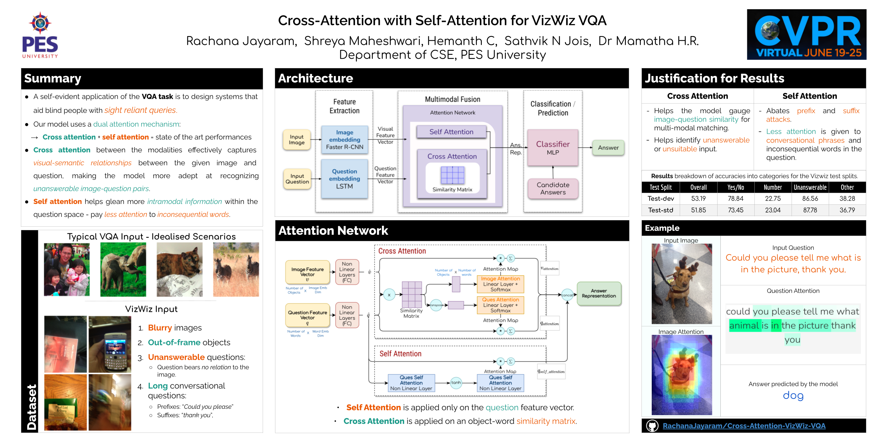

# Cross Attention with Self Attention for VizWiz-VQA

> Visual Question Answering is a machine comprehension challenge wherein, provided a natural language question about an image, the system autonomously infers a natural language answer for the posed question.

A self-evident application of the VQA task is to design systems that aid blind people with sight reliant queries. The VizWiz VQA dataset originates from images and questions compiled by members of the visually impaired community and as such, highlights some of the challenges presented by this particular use case

- the pictures taken are often of low quality - the image might be too blurry or too dark making the image incomprehensible
- The object of interest might also be out of frame of the image causing the question to seem unrelated to the image presented.
- The questions asked tend to be incomplete or conversational in nature as they are transcriptions of recorded vocal questions.

Our model addresses these challenges by employing a hybrid attention mechanism that involves both intermodal attention and intramodal attention.

- Cross attention between the modalities effectively captures visual-semantic relationships between the given image and question, making the model more adept at recognizing unanswerable image-question pairs.
- Self attention helps the model glean more intramodal information within the question space - inconsequential conversational phrases are given less attention, thereby improving question comprehension.

---

Presented our work as a [poster](https://vizwiz.org/workshops/2021-workshop/#block-01231653-1998-4062-8e7e-18be269aad97) at <big>[2021 VizWiz Grand Challenge Workshop](https://vizwiz.org/workshops/2021-workshop) </big>

- [CVPR 2021 Poster](https://ivc.ischool.utexas.edu/~yz9244/VizWiz_workshop_2021/poster_pdf/CrossAttSelfAtt_poster.pdf)
- [Abstract Paper](https://ivc.ischool.utexas.edu/~yz9244/VizWiz_workshop_2021/poster_pdf/CrossAttSelfAtt_abstract.pdf)
- [Teaser](https://ivc.ischool.utexas.edu/~yz9244/VizWiz_workshop_2021/videos/CrossAttSelfAtt_teaser.mp4)
- [VizWiz VQA 2021 Leaderboard (_"RAC MODEL"_)](https://eval.ai/web/challenges/challenge-page/743/leaderboard/2020#leaderboardrank-4)

## 

## Results

Results on the on the test-dev split of the Vizwiz dataset after training the model for 50 epochs on both the train and eval data splits:

| Model Name             | Overall Accuracy |
| ---------------------- | ---------------- |
| Cross Attention        | 52.53            |
| Self Attention         | 52.86            |
| Cross + Self Attention | **53.19**        |

---

## Details

- A Faster-RCNN model pre-trained on the Visual Genome dataset is used to obtain the image feature
  vector and a unidirectional single layer LSTM network is used to obtain the question feature vector.
- Multimodal fusion is done via a deep network implementing self attention and cross attention networks.
  - Self attention is applied only on the question feature vector.
  - Cross attention is applied on a matrix that encodes the similarity between every object in the
    image and every word in the question, in-order to
    model their inter-relationships.
- The answer representation r is just the concatenation
  of the attended feature vectors.
- A simple two layer MLP is used to classify the unifed
  answer representation into one of the answers in the
  candidate answer set.

Implementaton details -

1. The fixed number of objects in the image (K) is 36.
2. The fixed number of objects in the image (L) is 26, longer
   word length is used to accomodate longer-conversational
   questions.
3. The dimension of the object features is 2048.
4. The hidden size of the LSTM is 1024.
5. The set of answer candidates is created from all the
   correct answers that appear more than 4 times in the
   training and validation splits (The set size is 2770).
6. Adamax optimizer is used for training, with the batch size
   as 256. For the learning rate, we employ a warm-up
   strategy for the initial epochs and a decay for the final epochs.

---

## Steps to Run

Preprocessed data can be downloaded from `tools/download_script.sh`

Training the model:

```
python main.py --number_of_epochs=70 --use_train_and_val --add_self_attention=True --save_folder=save_folder/SelfCoAttModel
```

Find a pretrained model [here](https://drive.google.com/file/d/155MpwIzdh-fP2D8sT2KvRR4-oN91iATJ/view?usp=sharing) (70 epochs - both train and val splits).

Obtaining the predications for the test split (use the same flags!):

```
python test.py  --use_train_and_val --add_self_attention=True--save_folder=<path_to_save_folder>  --snapshot_path=<path_to_trained_model>
```

Running the model against the eval split:

```
python eval.py --use_train_and_val --add_self_attention=True --save_folder=<path_to_save_folder>  --snapshot_path=<path_to_trained_model>
```

---
